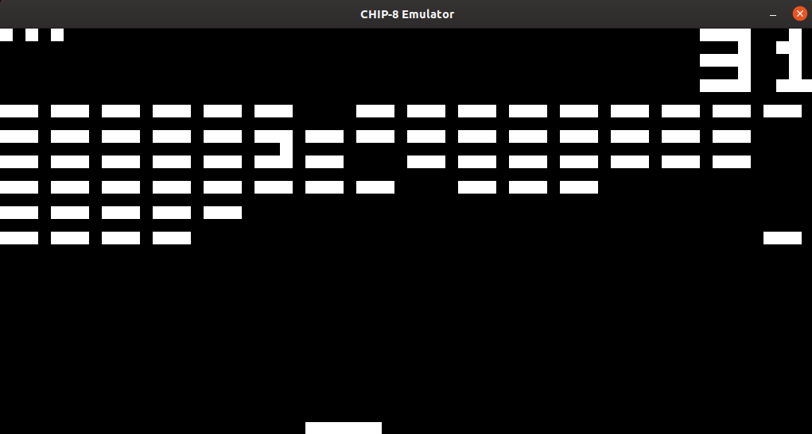

# Chip8 Emulator

A Chip8 Emulator written using C++

From [Wikipedia](https://en.wikipedia.org/wiki/CHIP-8):

>CHIP-8 is an interpreted programming language, developed by Joseph Weisbecker. It was initially used on the COSMAC VIP and Telmac 1800 8-bit microcomputers in the mid-1970s. CHIP-8 programs are run on a CHIP-8 virtual machine. It was made to allow video games to be more easily programmed for these computers. 



### Prerequisites

Must have SDL2 installed

### Installing
With SDL2 installed, simply clone the repository to your system and make:

```
git clone https://github.com/Ooelhana/Chip8-Emulator.git
cd Chip8-Emulator
make
```
### Usage
Download any Chip8 roms you would like and place them in the root Chip8-Emulator folder. I have put a sample brick breaker rom in the repository.

 In the command-line write:

`./chip8 [ROM NAME]`

### Key Mappings
Chip8 uses 16 keys. These keys have been mapped to

1 2 3 4

Q W E R

A S D F

Z X C V

## License

This project is licensed under the MIT License - see the [LICENSE.md](https://github.com/Ooelhana/Chip8-Emulator/blob/master/LICENSE) file for details

## Acknowledgments

* [Cowgod's Chip-8 Technical Reference](http://devernay.free.fr/hacks/chip8/C8TECH10.HTM) - The best Chip8 documentation on the web
* [Laurence Muller](http://www.multigesture.net/articles/how-to-write-an-emulator-chip-8-interpreter/) - for his blog on how to get started
